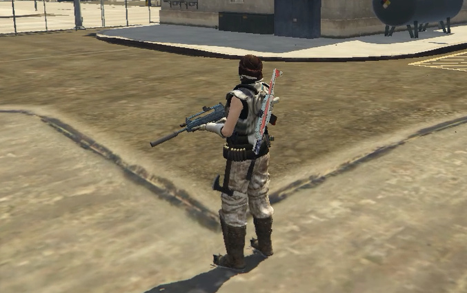

## WeaponOnBack

### Description
- Put / Sheath weapons on back, with components and tint
- 

### Features
- Put / Sheath weapons on back
- **Components and tint are displayed** - this is the first script achieved this AFAIK 
- Multiple slots (Left, right and spine)
- Flexible display, via switching weapons
- Adjustable attach position
- Smooth streaming across clients
- **OneSync-Only** - Runs on OneSync with StateBag feature, please keep server update-to-date

### Commands
- /wob pos x y z - Adjust attach position
- /wob rot x y z - Adjust attach rotation

### FXManifest
- local_interval_ms - Relative to local refresh rate
- network_interval_ms - Relative to network refresh rate

### Downloads
- View [repo](https://github.com/fivem-wl/future-world/tree/master/projects/weapon-on-back)
- Download [here](https://github.com/fivem-wl/future-world/releases)

### Credits
- Part of [fivem-wl](https://github.com/fivem-wl)
- Thanks to [fivem-js](https://github.com/d0p3t/fivem-js)
- License under [AGPL v3](https://github.com/fivem-wl/WeaponOnBack/blob/master/LICENSE)

### Donation
- If you like this script, please consider [buy me a coffee](https://www.paypal.com/donate/?business=2HDU7MFHLCBTY&currency_code=USD), **your kindness keeps weapon on your back!**
